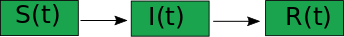
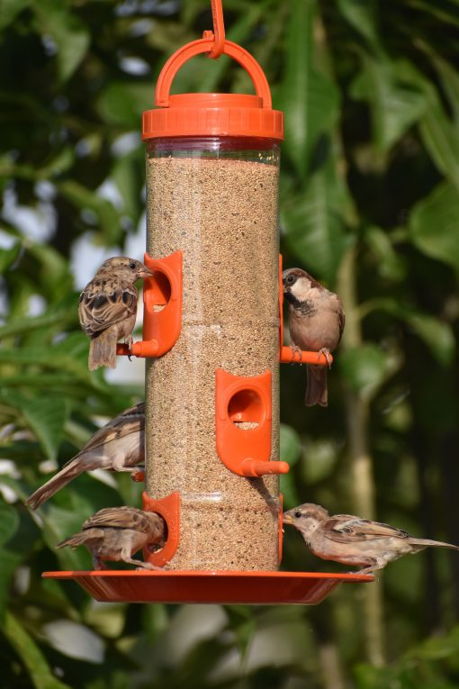

```{r setup, include=FALSE}
knitr::opts_chunk$set(echo = FALSE)
require(ggplot2)
```


# Compartmental models in epidemiology

---
# Overview of compartmental models
Compartmental models are used to propose simple dynamic mathematical models in
  - epidemiology,
  - pharmaco Kinetic, pharmaco dynamic,
  - hydrology,
  - etc ...
  
  Main idea : representing the whole system as a succession of homogeneous boxes and describing the flow between different boxes
  
```{r, out.width = "300px", fig.cap='Exemple of compartmental models'}

```

---
name: model
# Modelling example  

---
template: model 

```{r, out.width = "300px", fig.cap='Exemple of compartmental models'}

```

\begin{align*}
\frac{\partial X}{\partial t} & = - \alpha X(t) \cr
\frac{\partial Y}{\partial t} & = \alpha X(t)   -\delta Y(t) \cr
\frac{\partial Z}{\partial t} & = \delta Y(t) \cr
\end{align*}

---
template: model
## Kermack–McKendrick Epidemic Model: SIR model  


```{r, out.width = "300px", fig.cap='Exemple of compartmental models'}

```

\begin{align*}
\frac{\partial S}{\partial t} & = - \lambda S(t) I(t) \cr
\frac{\partial I}{\partial t} & = \lambda S(t) I(t) -\gamma I(t) \cr
\frac{\partial R}{\partial t} & = \gamma I(t) \cr
\end{align*}

---
template: model

## Kermack–McKendrick Epidemic Model: SIR model  
In proportion, setting $s =S/N$,  $i= I/N$ and $r=R/N$.

Assumption : close population, i.e. $s+i+r=1$ at all time.

\begin{align*}
\frac{\partial s}{\partial t} & = - \tilde{\lambda} s(t) i(t) \cr
\frac{\partial i}{\partial t} & = \tilde{\lambda} s(t) i(t) -\tilde{\gamma} i(t) \cr
\frac{\partial r}{\partial t} & = \tilde{\gamma} i(t) \cr
\end{align*}

with $\tilde{\lambda}=\lambda N$ and $\tilde{\gamma}=\gamma$.


---
template: model
## The threshold phenomenon and $R_0$

\begin{align*}
\frac{\partial s}{\partial t} & = - \beta s(t) i(t) \cr
\frac{\partial i}{\partial t} & = (\beta s(t) - \gamma )i(t)  \cr
\frac{\partial r}{\partial t} & = \gamma i(t) \cr
\end{align*}

- If $(\beta s(t) - \gamma ) \leq 0$, i.e  $s(t) \leq  \gamma / \beta$,  then $\frac{\partial i}{\partial t}\leq 0$ and the disease vanishes,
- $R_0=\beta/\gamma$ is the basic reproduction rate. 
  
  If $R_0>1$ the disease Is spreading.

---
template: model

## Solution to SIR model

Numerical simulation using Euler approximation :
\begin{align*}
s(t+\Delta_t) - s(t)  & = - \beta s(t) i(t) \Delta_t\cr
i(t+\Delta_t) - i(t)  &  = (\beta s(t) - \gamma )i(t)  \Delta_t \cr
r(t+\Delta_t) - r(t)   & = \gamma i(t) \Delta_t  \cr
\end{align*}

---
template: model

## Discrete time version of SIR


\begin{align*}
s_{t+1} & = s_t (1- \beta i_t) \cr
i_{t+1} & = (1 + \beta s_t - \gamma )i_t    \cr
r_{t+1} & =  r_t + \gamma i_t  \cr
\end{align*}

--

```{r discrete_sim, fig.dim=c(4.8, 5.5), fig.align = 'center'}
nGen <- 20
s0 <- 0.9
i0 <- 0.1
R0 <- 1.1
beta <- 0.95; gamma <- beta/R0

N0 <- 500

SIRdyn <- function(s0, i0, beta, gamma, nGen, N=1){
  if(N>1){
    beta <- beta/N
  }
  s <- i <- r <- rep(NA, nGen)
  s[1] <- N*s0; i[1] <- N*i0;  r[1] <- 0
  for( g in 2:nGen){
    s[g] <- s[g-1] * (1-beta*i[g-1])
    i[g] <- (1 + beta * s[g-1] - gamma) * i[g-1]
    r[g] <- r[g-1] + gamma*i[g-1]
  }
  return(data.frame(s=s, i=i, r=r, gen = 1:nGen))
}

lowDyn <-  SIRdyn(0.99, 0.01, beta, gamma, 50, 1)
p <- ggplot(data=lowDyn) + geom_line(aes(x=gen, y=s), col='lightblue') +  geom_line(aes(x=gen, y=i), col='red') + geom_line(aes(x=gen, y=r), col='darkgrey') + ggtitle(paste0('R0=', round(beta/gamma,2) ))
print(p)
```


---
template: model

## Discrete time version of SIR

Changing  the parameters

```{r discrete_sim2, fig.dim=c(4.8, 5.5), fig.align = 'center'}
R0 <- 2.1
beta <- 0.95; gamma <- beta/R0

lowDyn <-  SIRdyn(0.9, 0.1, beta, gamma, 50, 1)
p <- ggplot(data=lowDyn) + geom_line(aes(x=gen, y=s), col='lightblue') +  geom_line(aes(x=gen, y=i), col='red') + geom_line(aes(x=gen, y=r), col='darkgrey')  + ggtitle(paste0('R0=', round(beta/gamma,2) ))
print(p)
```

---
template: model

## Discrete time version of SIR

\begin{align*}
s_{t+1}  & = s_t (1- \beta i_t) \cr
i_{t+1} &  =   (1 + \beta s_t - \gamma )i_t    \cr
r_{t+1} & =  r_t + \gamma i_t  \cr
\end{align*}

```{r discrete_sim3, fig.dim=c(4.8, 5.5), fig.align = 'center'}
R0 <- 2.1
beta <- 0.1; gamma <- beta/R0

lowDyn <-  SIRdyn(0.9, 0.1, beta, gamma, 50, 1)
p <- ggplot(data=lowDyn) + geom_line(aes(x=gen, y=s), col='lightblue') +  geom_line(aes(x=gen, y=i), col='red') + geom_line(aes(x=gen, y=r), col='darkgrey') + ggtitle(paste0('R0=', round(beta/gamma,2) ))
print(p)
```

---
name: SIR

# Stochastic approaches of Compartmental models

---
template: SIR

## Why considering stochastic model ?
  - Interested in variability not only in average behaviour
  - Prediction of the probability of extinction due to a disease (mutation, ....)
  
--

## A very first simple SI model 

   - discrete time SI model
   - back to the S compartment in one time generation (back to S compartment)
   - every infected individual has a probability $p$ to infect a susceptible.

At time 0,  $I(0)=1$ and $S(0)=5$

--
* Why is it $(I(t), t\geq 0)$ a Markov chain?
* What is the state space ?
* Write the transition matrix and the initial probability.
* Is there a stationary distribution ? 


---
template: SIR

## A first simple model : Reed and Frost
 Originally  by Lowell Reed and Wade Hampton Frost, of Johns Hopkins University in 1920's.
 
   - discrete time SIR model
   - recovering in one time generation
   - every infected individual has a probability $pI$ to infect a susceptible.
   
   
* How to model the dynamic ? 
* Find the Markov chain of the story,
* Write a R function  to simulate this Markov chain with parameter $pI$ and $nGen$,
* How to numerically get the stationary distribution if it exists 

$N = 200,$ $I(0) \sim \mathcal{U}nif(\left\lbrace{1,2, ....30}\right\rbrace), R(0)=0,$ $pI = 0.02$

* Distribution of $I(1)$ ?

---
template: SIR

## A first simple model : Reed and Frost

```{r, echo=TRUE}
simReedFrost <- function(S0, I0, R0=0, pI, nGen, sim = 1){
  S <- I <- R <- rep(NA, nGen)
  S[1] <- S0; I[1] <- I0; R[1] <- R0
  for( g in 2:nGen){
    S[g] <- rbinom(size=S[g-1], n = 1, prob = (1-pI)^I[g-1])
    I[g] <- S[g-1]-S[g]
    R[g] <- R[g-1]+I[g-1]
  }
  return(data.frame(s=S, i=I, r=R, gen=1:nGen, sim=rep(sim, nGen)))
}
```

---
template: SIR

## A first simple model : Reed and Frost

```{r reed_frost_sim1, , fig.dim=c(4.8, 5.5), fig.align = 'center'}
nSim <- 10
R0 <- 2.1
beta <- 0.9
N <- 500
pI <- beta/ N
RF1.list <- lapply(1:nSim, function(d){simReedFrost(S0=450, I0=50, pI=0.001, nGen=200, sim=d)})
RF1 <- do.call('rbind', RF1.list)

p <- ggplot(RF1) + geom_line(aes(x=gen, y=s, group=sim), col='lightblue') +  geom_line( aes(x=gen, y=i, group=sim), col='red') + geom_line(aes(x=gen, y=r, group=sim), col='darkgrey')
print(p) 
```

---
template: SIR

## Impact of parameters

- Study the role of the initial conditions
- What is quantity corresponding to $R_0$ in the deterministic case ?

---
template: SIR

## Link between stochastic and deterministic SIR model : the  Reed and Frost example

$$S_{t+1}\sim \mathcal{B}in(S_t, (1-p_I)^{I_t})$$

Then 

$$\mathbb{E}(S_{t+1}-S_t) = S_t \left[(1-p_I)^{I_t}- 1\right]$$

--

If $p_I$ is small enough $(1-p_I)^{I_t}- 1\approx p_I I_t$ and therefore
$$\mathbb{E}(S_{t+1}-S_t) \approx S_t p_I I_t $$

---
template: SIR

## Stochastic version of  Kermack–McKendrick Model
Using the Reef Frost model but changing the recovering system. At each time step, infected has a probability $p_R$ to recover

  - Describe the evolution of $S,I,R$.
  - write the corresponding R function

---
template: SIR

## Stochastic version of  Kermack–McKendrick Model
```{r, echo=TRUE}
simKMac <- function(S0, I0, R0=0, pI, pR, nGen, sim=1){
  S <- I <- R <- rep(NA, nGen)
  N <- S0+I0+R0
  S[1] <- S0; I[1] <- I0; R[1] <- R0
  for( g in 2:nGen){
    S[g] <- rbinom(size=S[g-1], n = 1, prob = (1-pI)^I[g-1])
    R[g] <- R[g-1]+ rbinom(size=I[g-1], n = 1, prob = pR )  
    I[g] <- N-R[g]-S[g]
  }
  return(data.frame(s=S, i=I, r=R, gen=1:nGen, sim=rep(sim, nGen)))
}
```
---
template: SIR


## Stochastic version of  Kermack–McKendrick Model simulation


```{r}
nSim <- 10
R0 <- 2.1
beta <- 0.9
N <- 500
pI <- beta/ N
pR <-  gamma <- beta/R0
nSim <- 10
KM1.list <- lapply(1:nSim, function(d){simKMac(S0=450, I0=50, R0=0, pI=pI, pR = pR, nGen=50, sim=d)})
KM1 <- do.call('rbind', KM1.list)
p <- ggplot(KM1) + geom_line(aes(x=gen, y=s, group=sim), col='lightblue') +  geom_line( aes(x=gen, y=i, group=sim), col='red') + geom_line(aes(x=gen, y=r, group=sim), col='darkgrey')
print(p) 


```
---
template: SIR


## Link between stochastic and deterministic SIR model : the  Reed and Frost example

$$S_{t+1}\sim \mathcal{B}in(S_t, (1-p_I)^{I_t})$$
$$R_{t+1}-R_t\sim \mathcal{B}in(I_t, p_R)$$

Then 
$$\mathbb{E}(S_{t+1}-S_t) = S_t \left[(1-p_I)^{I_t}- 1\right],\quad \mathbb{E}(R_{t+1}-R_t) = I_t p_R$$

--

If $p_I$ is small enough $(1-p_I)^{I_t}- 1\approx p_I I_t$ and therefore
$$\mathbb{E}(S_{t+1}-S_t) \approx S_t p_I I_t $$
Therefore, by analogy 
$$\beta\approx p_I \quad \mbox{and}\quad \gamma=p_R$$
---

# Waiting time  on the bird feeder
.pull-left[
  
```{r bird_feeder, out.width = "200px", fig.cap='bird feeder'}

```
We assume that every second a bird stays on the feeder with  probability $p_F$ and leaves with probability $1-p_F$. 

At every second a new bird arrives with probability $p_A$ and left if no spot is available.


We consider a feeder with 5 spots and denote $N(t)$ the number of birds on the feeder  at time $t$ (t in second).

]
--
.pull-right[

* how to model $N(t)$ ?
* what is the state space ?
* write the transition matrix,
* what is the chance to see at least one bird on the feeder when coming at random ?
* What is the sojourn time of a bird on the feeder ?
* what is the expected waiting time for a bird 
  * arriving when 5 birds are on the feeder ?
  * arriving when at least one spot is free ?
* Using simulations, verify your results.  
]

---
# Waiting time  on the bird feeder

Try to develop a model for a feeder with a waiting area and enjoy it on simulation, 

(think about how to deal with waiting birds, and competition between wainting birds and arriving birds)


Enjoy it on simulation
