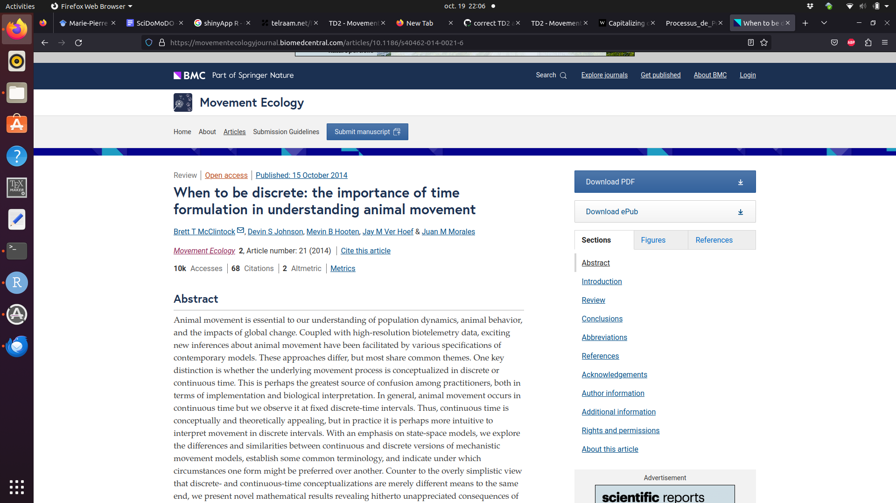
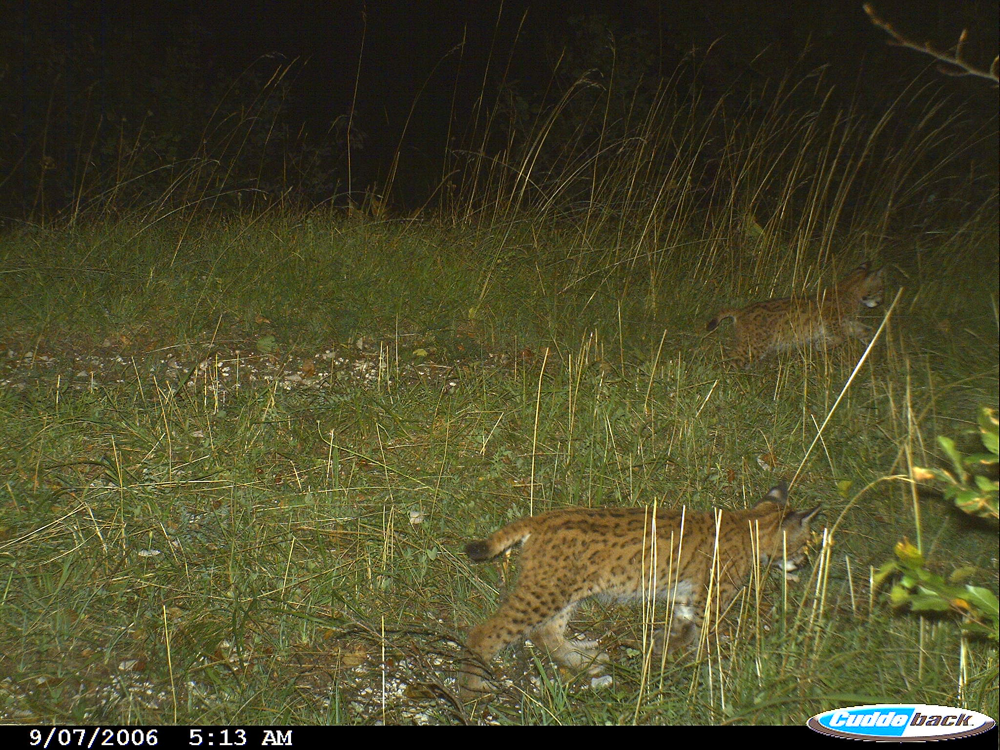

```{r setup, include=FALSE}
knitr::opts_chunk$set(echo = FALSE)
require(ggplot2)
library(tidyverse)
```


# Continuous time modelling why ?

```{r continuous_time, out.width = "400px"}

```

--

Example of bird feeder models. The discretization has a cost.

* realism,
* different discretization will result in difficult comparison
* more fun in continuous time.

--

Focus on discrete state space and continuous time

---

# Homogeneous Poisson process

.pull-left[
```{r pp, echo = FALSE, fig.cap = "A realisation of a Poisson process"}
set.seed(54321)
n <- 20
temps <- cumsum(c(0,rexp(n, rate = 1)))
dta <- tibble(temps = temps, count= seq(0,n)) %>% 
  filter(temps<10)
dta %>% 
  ggplot() + aes(x= temps, y = count) +
  geom_step()
```
]

.pull-right[
$(N(t), t\geq 0)$ représente

* Nombre de bus passés à l'arrêt jusqu'au temps $t$,
* Le nombre de visites à mamie,
* le nombre d'immigration dans une colonie,
* le nombre de détection d'un animal,
]

---

# Homogeneous Poisson process - Camera trap

```{r trap, out.width = "400px"}

```

---

# Homogeneous Poisson process - Camera trap

```{r lynx, out.width = "500px"}

```

---

```{r pp_point, echo = FALSE, fig.cap = "A realisation of a Poisson process"}
dta %>% 
  ggplot() + aes(x= temps) +
  geom_point(aes(y=0), col = "red", size = 2 )
```

---

# Homogeneous Poisson process - Definition

Un processus de Poisson de densité $\lambda$ est un processus $(N (t), t\geq 0)$ 
1. $N(0) = 0,$, pour tout $t$, $N(t)$ est un entier naturel, l'application $t\mapsto N(t)$ est croissante (processus de comptage).

2. Le processus est à accroissement indépendants : pour tout $t_0 < t_1 < \ldots < t_k$, les variables
aléatoires $N(t_k) − N(t_{k−1}), \ldots, N(t_1) - N(t_0)$ sont indépendantes et pour tout (s, t) $N (s + t) − N (s)$ suit la loi de Poisson de paramètre $\lambda t$.

--
Ceci justifie le choix d'une loi de Poisson pours les processus de comptage

--
## Vision infinitésimale 
$P(N(t+\Delta t) - N(t) = 1) = \lambda \Delta t + o(\Delta t)$
$P(N(t+\Delta t) - N(t) = 0) = 1- \lambda \Delta t + o(\Delta t)$
$P(N(t+\Delta t) - N(t) = 2) =  o(\Delta t)$


Ceci implique que le temps d'attente est exponentiel


---
# Processus de Poisson - simulation

On se donne $lambda = 2$, on veut simuler un processus de Poisson sur $[0,T_{Max}]$

* Tirer une variable aléatoire exponetielle $U_1$ et poser $T_1=U_1$

pour $i\geq 2$
* tant que $T_{i-1} < T_{Max},$ Tirer $U_{i}$ 
  * si $T_{i-1} + U_i < T_{Max}$, poser $T_{i} = T_{i-1} + U_i$,
  * sinon STOP


---
# Processus de Poisson - simulation

Une autre méthode

On tire le nombre de points dans l'intervalle avec une loi de Poisson de paramêtre $\lambda T_{Max},$ puis on les jette uniformément sur l'intervalle


---

# Non Homogeneous Poisson process - Definition

Un processus de Poisson de densité $\lambda(t)$ est un processus $(N (t), t\geq 0)$ 
1. $N(0) = 0,$, pour tout $t$, $N(t)$ est un entier naturel, l'application $t\mapsto N(t)$ est croissante (processus de comptage).

2. Le processus est à accroissement indépendants : pour tout $t_0 < t_1 < \ldots < t_k$, les variables
aléatoires $N(t_k) − N(t_{k−1}), \ldots, N(t_1) - N(t_0)$ sont indépendantes et pour tout (s, t) $N (s + t) − N (s)$ suit la loi de Poisson de paramètre $\int_s^{s+t} \lambda(u) du$.

--
## Vision infinitésimale 
$P(N(t+\Delta t) - N(t) = 1) = \lambda(t) \Delta t + o(\Delta t)$
$P(N(t+\Delta t) - N(t) = 0) = 1- \lambda(t) \Delta t + o(\Delta t)$
$P(N(t+\Delta t) - N(t) = 2) =  o(\Delta t)$


Ceci implique que le temps d'attente est exponentiel


---
# Processus de Poisson - simulation thinning

On se donne un $lambda^*$ qui majore $\lambda(t)$ sur $[0, Tmax]$

* On simule un PP homogène d'intensité $\lambda^*$
* On garde chaque point $t_i$ obtenu avec proba $\lambda(t_i)\lambda^*$

--
problème de $\lambda^*$ sur dimensionné


Exo : Simuler sur [0,20], un PP d'intensité $3t +1$ et vérifier que le nombre de poids qui tombe sur lintervalle $[0,20]$ suit une loi de Poisson dont vous déterminerez le paramètre.

--

comment rendre l'algo plus efficace ?


---
# Processus de naissance pur

## Vision infinitésimale 
$P(N(t+\Delta t) - N(t) = 1) = \lambda N(t) \Delta t + o(\Delta t)$
$P(N(t+\Delta t) - N(t) = 0) = 1- \lambda N(t) \Delta t + o(\Delta t)$
$P(N(t+\Delta t) - N(t) = 2) =  o(\Delta t)$


Comment interpréter ce processus ? 

Comment simuler ce processus ? 


---
# Processus de mort pur

## Vision infinitésimale 
$P(N(t+\Delta t) - N(t) = - 1) = \mu N(t) \Delta t + o(\Delta t)$
$P(N(t+\Delta t) - N(t) = 0) = 1- \mu N(t) \Delta t + o(\Delta t)$
$P(N(t+\Delta t) - N(t) = -2) =  o(\Delta t)$


Comment interpréter ce processus ? 

Comment simuler ce processus ? 


---
# Processus de naissance et mort 

## Vision infinitésimale 
$P(N(t+\Delta t) - N(t) = - 1) = \mu N(t) \Delta t + o(\Delta t)$
$P(N(t+\Delta t) - N(t) =  1) = \lambda N(t) \Delta t + o(\Delta t)$
$P(N(t+\Delta t) - N(t) = 0) = 1 - (\mu+\lambda) N(t) \Delta t + o(\Delta t)$
$P(N(t+\Delta t) - N(t) = 2) =  o(\Delta t)$


Comment interpréter ce processus ? 

Comment simuler ce processus ? 

---

# Exercice

Proposez un modèle de dynamique de population avec naissance et mort mais également immigration.


